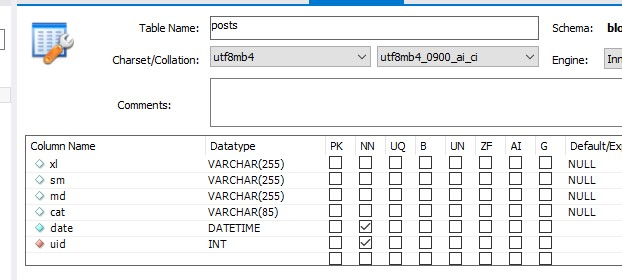
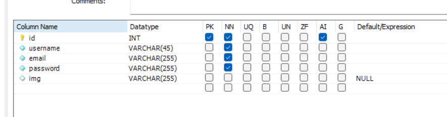
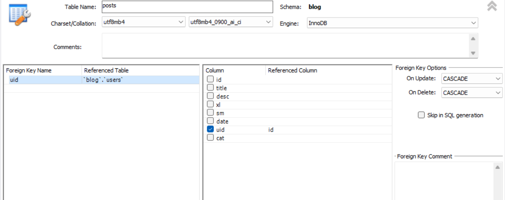
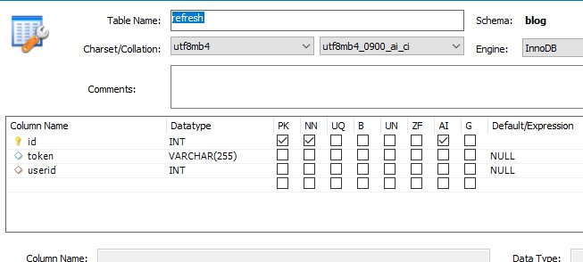
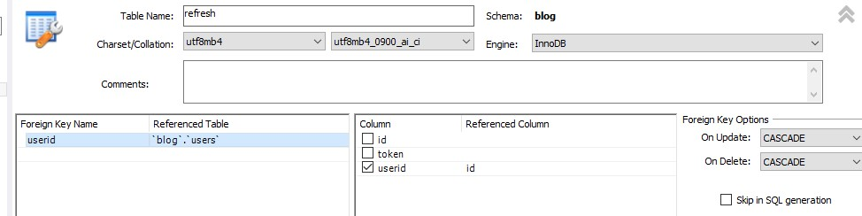

Simple blog site on mysql and react

> [!WARNING]
>Before copying and start the project add your data in the file "db.js"
>replace 'your_username', 'your_password_for_db', 'your_database_name' </br>
>```javascript
>host = 'localhost'; </br>
>user = 'your_username'; </br>
>password = 'your_password'; </br>
>database = 'your_database_name'; </br>

> [!NOTE]
>Before start project
> create mysql db 'posts', 'users' and 'refresh'
examples on screenshots
> 


>users









> [!NOTE]
> To start the project you need to run:

#### On server folder
command "node init -y" and "node install"
after "npm start" for start server

#### On client folder
command "node init -y" and "node install"
after "npm run dev"
